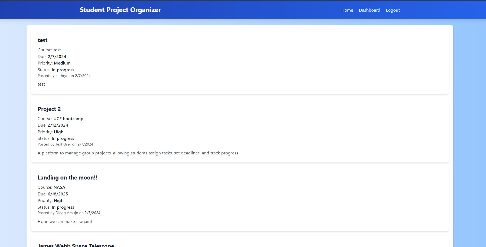

# Student Project Organizer

The Student Project Organizer is a comprehensive tool designed to help students manage their academic projects with efficiency and ease. This application offers functionalities to assign tasks, set deadlines, track progress, and much more, ensuring students stay organized and ahead in their academic journey.

## Table of Contents

- [User Story](#user-story)
- [Features](#features)
- [Installation](#installation)
- [Contributing](#contributing)
- [License](#license)
- [Technologies Used](#technologies-used)

## Features

- **Project Management**: Add, view, edit, and delete projects with all the essential details like course name, title, description, and due dates.
- **Dashboard**: A user-friendly interface to visualize projects.
- **Priority Levels**: Mark projects with priority levels for better organization.
- **Progress Tracking**: Mark projects as 'in progress' or 'completed' and track your progress visually.
- **User Authentication**: Secure login/signup/logout functionality to ensure user data privacy and security.
- **Interactive Features**: Engage by posting new projects, commenting on others, and using a dashboard for managing existing projects.
- **Responsive Web Design**: The application is fully functional and looks great on both desktop and mobile devices, ensuring a seamless user experience regardless of the device used.
- **Data Persistence**: All user data, including projects, is stored securely and persists across sessions, so you never lose track of your progress.

# Contributing

Contributions are welcome! Please fork the repository and open a pull request with your updates.

If you have a suggestion that would make this better, please fork the repo and create a pull request. You can also simply open an issue with the tag "enhancement".

## Technologies Used

- `bcrypt`: For hashing and securing user passwords.
- `connect-session-sequelize`: To connect the Sequelize ORM with express sessions.
- `dotenv`: To load environment variables from a `.env` file.
- `express`: As the Node.js web application framework.
- `express-handlebars`: As the Handlebars view engine for Express.
- `express-session`: For managing user sessions.
- `mysql2`: As a MySQL client for Node.js.
- `sequelize`: As a promise-based Node.js ORM for MySQL.

## Installation

To install the application, clone the repository to your local machine using git clone (git@github.com:DiegoAR98/Student-Project-Organizer.git). Then, navigate to the project directory and run npm install to install all necessary dependencies.

## License

This project is licensed under the MIT License - see the [LICENSE](LICENSE) file for details.

## Deployment

This application is deployed on Heroku.[Click here](https://student-project-organizer-f32e9a6cf079.herokuapp.com/) to view the project on Heroku.

